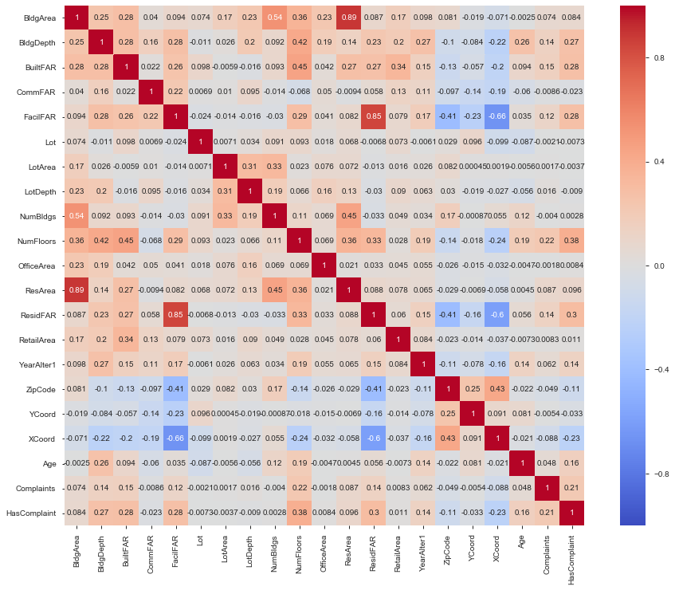
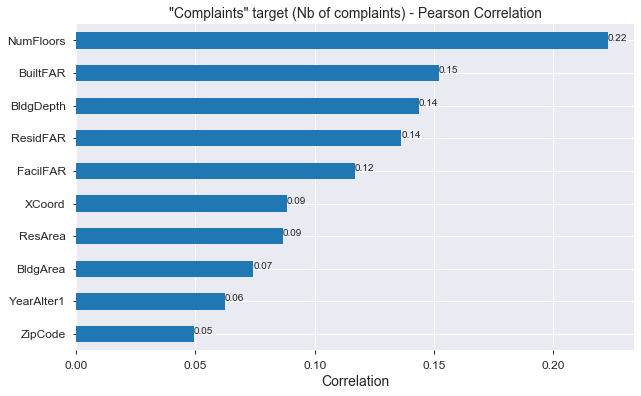
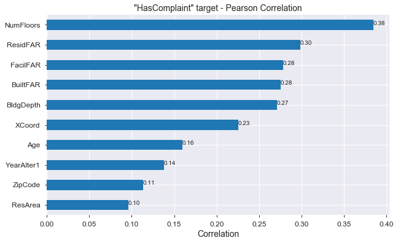
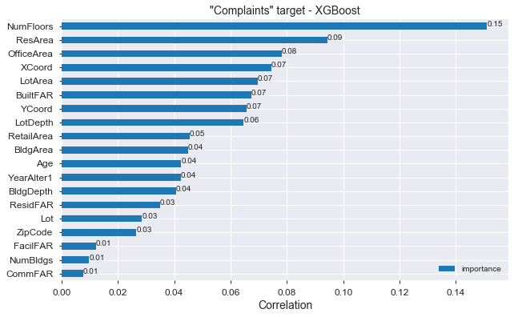

 # IBM DS0720EN - Capstone Project
 Chris.  -- https://github.com/chris-FR-GitHub/EDX-IBM

## <font color=blue>Q3 :Does the Complaint Type that you identified in response to question 1 have an obvious relationship with any particular characteristic or characteristics of the houses or buildings?</font>

### Install the libraries (if necessary)


```python
# !pip install --upgrade pip
# !pip install pandas-profiling 
# !pip install Folium
# !pip install scikit-learn
# !pip install xgboost
```


```python
# !pip install xgboost
```

### Note

For this question, we will use the **BX_18v1.csv** PLUTO file located in the **input** folder.

### Load the complaints file and filter it to keep : <font color="red">'HEAT/HOT WATER' & 'HEATING'</font> types and <font color="red">'BRONX'</font> borough


```python
# Import required libs
import pandas as pd
import numpy as np
import matplotlib.pyplot as plt
import seaborn as sns
import datetime as d

from sklearn.ensemble import RandomForestRegressor
from sklearn.tree import DecisionTreeRegressor
from sklearn import datasets
from sklearn.model_selection import train_test_split
from sklearn.feature_selection import SelectFromModel
from sklearn.metrics import accuracy_score
from sklearn.metrics import mean_absolute_error

import xgboost as xgb
from sklearn.metrics import mean_squared_error
from sklearn.utils import shuffle

import pandas_profiling

from IPython.display import display
%matplotlib inline

pd.options.display.float_format = '{:20,.3f}'.format
pd.options.display.max_columns = None
pd.options.display.max_colwidth = 1000
np.set_printoptions(precision=3)
```


```python
# Load the file in a dataframe
# As suggested in the "Ingest the NYC 311 Dataset" page : Parse the date fields by using the parse_dates option
df_heating_bronx = pd.read_csv('./input/NYC_311_Dataset.csv', parse_dates = ['created_date', 'closed_date'])

# merge  'HEAT/HOT WATER' & 'HEATING' type complaints
df_heating_bronx['complaint_type'].replace(
    to_replace=['HEAT/HOT WATER', 'HEATING'],
    value='HEATING/HOT WATER',
    inplace=True
)

# Keep only these 2 types
df_heating_bronx = df_heating_bronx[df_heating_bronx['complaint_type'] == 'HEATING/HOT WATER']

# Keep only the BRONX borough
df_heating_bronx = df_heating_bronx[df_heating_bronx['borough'] == 'BRONX']

# Convert ZIP as INT and process_days columns
import datetime as dt
today=dt.datetime.now() #.date()
df_heating_bronx['incident_zip'] = df_heating_bronx.incident_zip.fillna('00000').astype(int)
df_heating_bronx['process_days'] = (df_heating_bronx['closed_date'].fillna(today) - df_heating_bronx['created_date']).dt.days.astype(int) 
df_heating_bronx.head(2)


```


<div>
<style scoped>
    .dataframe tbody tr th:only-of-type {
        vertical-align: middle;
    }

    .dataframe tbody tr th {
        vertical-align: top;
    }

    .dataframe thead th {
        text-align: right;
    }
</style>
<table border="1" class="dataframe">
  <thead>
    <tr style="text-align: right;">
      <th></th>
      <th>created_date</th>
      <th>unique_key</th>
      <th>complaint_type</th>
      <th>incident_zip</th>
      <th>incident_address</th>
      <th>street_name</th>
      <th>address_type</th>
      <th>city</th>
      <th>resolution_description</th>
      <th>borough</th>
      <th>latitude</th>
      <th>longitude</th>
      <th>closed_date</th>
      <th>location_type</th>
      <th>status</th>
      <th>process_days</th>
    </tr>
  </thead>
  <tbody>
    <tr>
      <td>0</td>
      <td>2020-01-28 20:26:11</td>
      <td>45492325</td>
      <td>HEATING/HOT WATER</td>
      <td>10462</td>
      <td>2040 BRONXDALE AVENUE</td>
      <td>BRONXDALE AVENUE</td>
      <td>ADDRESS</td>
      <td>BRONX</td>
      <td>The complaint you filed is a duplicate of a condition already reported by another tenant for a building-wide condition. The original complaint is still open. HPD may attempt to contact you to verify the correction of the condition or may conduct an inspection of your unit if the original complainant is not available for verification.</td>
      <td>BRONX</td>
      <td>40.851</td>
      <td>-73.867</td>
      <td>NaT</td>
      <td>RESIDENTIAL BUILDING</td>
      <td>Open</td>
      <td>10</td>
    </tr>
    <tr>
      <td>4</td>
      <td>2020-01-28 14:10:04</td>
      <td>45492347</td>
      <td>HEATING/HOT WATER</td>
      <td>10463</td>
      <td>2800 BAILEY AVENUE</td>
      <td>BAILEY AVENUE</td>
      <td>ADDRESS</td>
      <td>BRONX</td>
      <td>The complaint you filed is a duplicate of a condition already reported by another tenant for a building-wide condition. The original complaint is still open. HPD may attempt to contact you to verify the correction of the condition or may conduct an inspection of your unit if the original complainant is not available for verification.</td>
      <td>BRONX</td>
      <td>40.873</td>
      <td>-73.906</td>
      <td>NaT</td>
      <td>RESIDENTIAL BUILDING</td>
      <td>Open</td>
      <td>11</td>
    </tr>
  </tbody>
</table>
</div>


```python
# Get the dataframe size
df_heating_bronx.shape
```


    (604848, 16)


### Check NaN values


```python
# Count NaN values in each column
df_NaN_count = df_heating_bronx.isnull().sum(axis = 0)
df_NaN_count = df_NaN_count.to_frame()
df_NaN_count.rename(columns = {list(df_NaN_count)[0]:'Count'}, inplace=True)
df_NaN_count['NaN %'] = df_NaN_count['Count'] / len(df_heating_bronx)
df_NaN_count['NaN %'] = df_NaN_count['NaN %'].map(lambda x: "{0:.2f}%".format(x*100))
df_NaN_count
```


<div>
<style scoped>
    .dataframe tbody tr th:only-of-type {
        vertical-align: middle;
    }

    .dataframe tbody tr th {
        vertical-align: top;
    }

    .dataframe thead th {
        text-align: right;
    }
</style>
<table border="1" class="dataframe">
  <thead>
    <tr style="text-align: right;">
      <th></th>
      <th>Count</th>
      <th>NaN %</th>
    </tr>
  </thead>
  <tbody>
    <tr>
      <td>created_date</td>
      <td>0</td>
      <td>0.00%</td>
    </tr>
    <tr>
      <td>unique_key</td>
      <td>0</td>
      <td>0.00%</td>
    </tr>
    <tr>
      <td>complaint_type</td>
      <td>0</td>
      <td>0.00%</td>
    </tr>
    <tr>
      <td>incident_zip</td>
      <td>0</td>
      <td>0.00%</td>
    </tr>
    <tr>
      <td>incident_address</td>
      <td>1</td>
      <td>0.00%</td>
    </tr>
    <tr>
      <td>street_name</td>
      <td>1</td>
      <td>0.00%</td>
    </tr>
    <tr>
      <td>address_type</td>
      <td>5803</td>
      <td>0.96%</td>
    </tr>
    <tr>
      <td>city</td>
      <td>5986</td>
      <td>0.99%</td>
    </tr>
    <tr>
      <td>resolution_description</td>
      <td>29</td>
      <td>0.00%</td>
    </tr>
    <tr>
      <td>borough</td>
      <td>0</td>
      <td>0.00%</td>
    </tr>
    <tr>
      <td>latitude</td>
      <td>5986</td>
      <td>0.99%</td>
    </tr>
    <tr>
      <td>longitude</td>
      <td>5986</td>
      <td>0.99%</td>
    </tr>
    <tr>
      <td>closed_date</td>
      <td>2090</td>
      <td>0.35%</td>
    </tr>
    <tr>
      <td>location_type</td>
      <td>0</td>
      <td>0.00%</td>
    </tr>
    <tr>
      <td>status</td>
      <td>0</td>
      <td>0.00%</td>
    </tr>
    <tr>
      <td>process_days</td>
      <td>0</td>
      <td>0.00%</td>
    </tr>
  </tbody>
</table>
</div>


We will use **incident_address** column value to merge with the PLUTO dataframe.  
Remove record with a NaN value in this column.  


```python
df_heating_bronx.dropna(subset=['incident_address'], inplace=True)
df_heating_bronx.shape
```


    (604847, 16)


```python
df_heating_bronx['incident_address'].nunique()
```


    22836


```python
len(df_heating_bronx['incident_address'])
```


    604847


We have 22836 distinct incident addresses, and a total of 604847 complaints.

### Compute the number of complaints by 'incident_address'

To add the number of compalinst to a specific PLUTO address, we compute the number of complaints by incident address.


```python
df_complaints_count = df_heating_bronx.groupby(['incident_address']).size()
df_complaints_count = df_complaints_count.reset_index()
df_complaints_count.columns.values[1] = "Complaints"
df_complaints_count.head(10)
```


<div>
<style scoped>
    .dataframe tbody tr th:only-of-type {
        vertical-align: middle;
    }

    .dataframe tbody tr th {
        vertical-align: top;
    }

    .dataframe thead th {
        text-align: right;
    }
</style>
<table border="1" class="dataframe">
  <thead>
    <tr style="text-align: right;">
      <th></th>
      <th>incident_address</th>
      <th>Complaints</th>
    </tr>
  </thead>
  <tbody>
    <tr>
      <td>0</td>
      <td>1 ADRIAN AVENUE</td>
      <td>39</td>
    </tr>
    <tr>
      <td>1</td>
      <td>1 CAROLL STREET</td>
      <td>18</td>
    </tr>
    <tr>
      <td>2</td>
      <td>1 DOROTHEA PLACE</td>
      <td>1</td>
    </tr>
    <tr>
      <td>3</td>
      <td>1 EARHART LANE</td>
      <td>2</td>
    </tr>
    <tr>
      <td>4</td>
      <td>1 EAST  169 STREET</td>
      <td>1</td>
    </tr>
    <tr>
      <td>5</td>
      <td>1 EAST  198 STREET</td>
      <td>31</td>
    </tr>
    <tr>
      <td>6</td>
      <td>1 EAST 169 STREET</td>
      <td>1</td>
    </tr>
    <tr>
      <td>7</td>
      <td>1 EAST 198 STREET</td>
      <td>42</td>
    </tr>
    <tr>
      <td>8</td>
      <td>1 EAST 212 STREET</td>
      <td>3</td>
    </tr>
    <tr>
      <td>9</td>
      <td>1 METROPOLITAN OVAL</td>
      <td>31</td>
    </tr>
  </tbody>
</table>
</div>


```python
df_complaints_count.sort_values(by=['Complaints'],ascending=False).head(10)
```


<div>
<style scoped>
    .dataframe tbody tr th:only-of-type {
        vertical-align: middle;
    }

    .dataframe tbody tr th {
        vertical-align: top;
    }

    .dataframe thead th {
        text-align: right;
    }
</style>
<table border="1" class="dataframe">
  <thead>
    <tr style="text-align: right;">
      <th></th>
      <th>incident_address</th>
      <th>Complaints</th>
    </tr>
  </thead>
  <tbody>
    <tr>
      <td>15194</td>
      <td>3810 BAILEY AVENUE</td>
      <td>7113</td>
    </tr>
    <tr>
      <td>333</td>
      <td>1025 BOYNTON AVENUE</td>
      <td>5774</td>
    </tr>
    <tr>
      <td>8017</td>
      <td>2090 EAST TREMONT AVENUE</td>
      <td>3706</td>
    </tr>
    <tr>
      <td>21713</td>
      <td>888 GRAND CONCOURSE</td>
      <td>3034</td>
    </tr>
    <tr>
      <td>12389</td>
      <td>2968 PERRY AVENUE</td>
      <td>2917</td>
    </tr>
    <tr>
      <td>7936</td>
      <td>2074 WALLACE AVENUE</td>
      <td>2578</td>
    </tr>
    <tr>
      <td>403</td>
      <td>1030 BOYNTON AVENUE</td>
      <td>2482</td>
    </tr>
    <tr>
      <td>11062</td>
      <td>266 BEDFORD PARK BOULEVARD</td>
      <td>2464</td>
    </tr>
    <tr>
      <td>7726</td>
      <td>2040 BRONXDALE AVENUE</td>
      <td>2418</td>
    </tr>
    <tr>
      <td>4025</td>
      <td>1425 DR M L KING JR BOULEVARD</td>
      <td>2268</td>
    </tr>
  </tbody>
</table>
</div>


```python
df_complaints_count.nunique()
```


    incident_address    22836
    Complaints            483
    dtype: int64


### Load the 'BRONX' PLUTO file


```python
# Limit the Pluto database to the BRONX file
df_Bronx= pd.read_csv('./input/BX_18v1.csv')

# Limit the fields to the following:
#     Address, BldgArea, BldgDepth, BuiltFAR, 
#     CommFAR, FacilFAR, Lot, LotArea, LotDepth, NumBldgs, 
#     NumFloors, OfficeArea, ResArea, ResidFAR, RetailArea, 
#     YearBuilt, YearAlter1, ZipCode, YCoord, and XCoord.
df_Bronx = df_Bronx[['Address', 'BldgArea', 'BldgDepth', 'BuiltFAR', 'CommFAR', 
                     'FacilFAR', 'Lot', 'LotArea', 'LotDepth', 'NumBldgs', 'NumFloors', 
                     'OfficeArea', 'ResArea', 'ResidFAR', 'RetailArea', 
                     'YearBuilt', 'YearAlter1', 'ZipCode', 'YCoord', 'XCoord']]

# df_Bronx = df_Bronx.dropna()

df_Bronx.shape
```

    C:\Anaconda3\lib\site-packages\IPython\core\interactiveshell.py:3058: DtypeWarning: Columns (19,20,22,23,64,65,80) have mixed types. Specify dtype option on import or set low_memory=False.
      interactivity=interactivity, compiler=compiler, result=result)
    


    (89854, 20)


```python
df_Bronx.head(5)
```


<div>
<style scoped>
    .dataframe tbody tr th:only-of-type {
        vertical-align: middle;
    }

    .dataframe tbody tr th {
        vertical-align: top;
    }

    .dataframe thead th {
        text-align: right;
    }
</style>
<table border="1" class="dataframe">
  <thead>
    <tr style="text-align: right;">
      <th></th>
      <th>Address</th>
      <th>BldgArea</th>
      <th>BldgDepth</th>
      <th>BuiltFAR</th>
      <th>CommFAR</th>
      <th>FacilFAR</th>
      <th>Lot</th>
      <th>LotArea</th>
      <th>LotDepth</th>
      <th>NumBldgs</th>
      <th>NumFloors</th>
      <th>OfficeArea</th>
      <th>ResArea</th>
      <th>ResidFAR</th>
      <th>RetailArea</th>
      <th>YearBuilt</th>
      <th>YearAlter1</th>
      <th>ZipCode</th>
      <th>YCoord</th>
      <th>XCoord</th>
    </tr>
  </thead>
  <tbody>
    <tr>
      <td>0</td>
      <td>122 BRUCKNER BOULEVARD</td>
      <td>0</td>
      <td>0.000</td>
      <td>0.000</td>
      <td>5.000</td>
      <td>6.500</td>
      <td>1</td>
      <td>15000</td>
      <td>200.000</td>
      <td>1</td>
      <td>0.000</td>
      <td>0</td>
      <td>0</td>
      <td>6.020</td>
      <td>0</td>
      <td>0</td>
      <td>0</td>
      <td>10,454.000</td>
      <td>232,162.000</td>
      <td>1,005,957.000</td>
    </tr>
    <tr>
      <td>1</td>
      <td>126 BRUCKNER BOULEVARD</td>
      <td>752</td>
      <td>16.000</td>
      <td>0.050</td>
      <td>5.000</td>
      <td>6.500</td>
      <td>4</td>
      <td>13770</td>
      <td>100.000</td>
      <td>2</td>
      <td>1.000</td>
      <td>272</td>
      <td>0</td>
      <td>6.020</td>
      <td>0</td>
      <td>1931</td>
      <td>1994</td>
      <td>10,454.000</td>
      <td>232,156.000</td>
      <td>1,006,076.000</td>
    </tr>
    <tr>
      <td>2</td>
      <td>138 BRUCKNER BOULEVARD</td>
      <td>39375</td>
      <td>200.000</td>
      <td>1.130</td>
      <td>5.000</td>
      <td>6.500</td>
      <td>10</td>
      <td>35000</td>
      <td>200.000</td>
      <td>1</td>
      <td>2.000</td>
      <td>0</td>
      <td>0</td>
      <td>6.020</td>
      <td>0</td>
      <td>1931</td>
      <td>0</td>
      <td>10,454.000</td>
      <td>232,036.000</td>
      <td>1,006,187.000</td>
    </tr>
    <tr>
      <td>3</td>
      <td>144 BRUCKNER BOULEVARD</td>
      <td>12500</td>
      <td>85.000</td>
      <td>5.000</td>
      <td>5.000</td>
      <td>6.500</td>
      <td>17</td>
      <td>2500</td>
      <td>100.000</td>
      <td>1</td>
      <td>5.000</td>
      <td>0</td>
      <td>12500</td>
      <td>6.020</td>
      <td>0</td>
      <td>1931</td>
      <td>2001</td>
      <td>10,454.000</td>
      <td>232,033.000</td>
      <td>1,006,299.000</td>
    </tr>
    <tr>
      <td>4</td>
      <td>148 BRUCKNER BOULEVARD</td>
      <td>8595</td>
      <td>70.000</td>
      <td>4.580</td>
      <td>5.000</td>
      <td>6.500</td>
      <td>18</td>
      <td>1875</td>
      <td>75.000</td>
      <td>1</td>
      <td>5.000</td>
      <td>0</td>
      <td>6876</td>
      <td>6.020</td>
      <td>1719</td>
      <td>1920</td>
      <td>2009</td>
      <td>10,454.000</td>
      <td>232,040.000</td>
      <td>1,006,363.000</td>
    </tr>
  </tbody>
</table>
</div>


Convert the ZIP code as string.


```python
# df_Bronx['ZipCode'] = df_Bronx['ZipCode'].astype(int).astype(str)
```

#### <font color="blue">Quizz - Can you determine the age of the building from the PLUTO dataset?</font>

We have the **'YearBuilt'** column. We should be able to compute the building Age column.  


```python
df_Bronx['YearBuilt'].unique()
```


    array([   0, 1931, 1920, 1967, 1963, 1973, 1984, 1915, 1990, 2003, 1925,
           1906, 1956, 2000, 2001, 1900, 1909, 1921, 1945, 1905, 1998, 1910,
           2005, 1993, 1907, 1961, 1935, 2004, 2002, 1957, 1901, 2015, 1964,
           1970, 1972, 1976, 1992, 1960, 1897, 1952, 1996, 1994, 1918, 1997,
           1913, 1951, 1924, 1926, 1927, 1891, 1899, 2006, 1890, 1986, 1932,
           1974, 1923, 2007, 1983, 1975, 2013, 1966, 1904, 1903, 1902, 2017,
           1995, 1933, 2008, 1991, 1969, 2016, 1889, 1888, 1887, 1930, 1912,
           2010, 2009, 1981, 1962, 1965, 1880, 1958, 1936, 1955, 2012, 1895,
           1886, 1989, 1938, 1940, 1928, 1911, 1917, 1954, 1988, 1950, 1914,
           2011, 1908, 1929, 1959, 1978, 2014, 1971, 1941, 1896, 1953, 1947,
           1948, 1922, 1949, 1919, 1979, 1980, 1937, 1916, 1944, 1800, 1999,
           1977, 1943, 1968, 1987, 1934, 1982, 1939, 1942, 1985, 1946, 1898,
           1850, 1892, 1812, 1780, 1884, 1853, 1885, 1883, 1878, 1849, 1868,
           1870, 1893, 1848], dtype=int64)


We have some 0 in the column.


```python
(df_Bronx['YearBuilt'] == 0).sum()
```


    6367


We will replace this value by the current year to compute the age column.


```python
#df_Bronx = df_Bronx[df_Bronx['YearBuilt'] != 0]

current_year = int(d.datetime.now().year)

df_Bronx['YearBuilt'].replace(
    to_replace=[0],
    value=current_year,
    inplace=True
)
```


```python
# Compute the Age Column
df_Bronx['Age'] = current_year - df_Bronx['YearBuilt']
df_Bronx.head(5)
```


<div>
<style scoped>
    .dataframe tbody tr th:only-of-type {
        vertical-align: middle;
    }

    .dataframe tbody tr th {
        vertical-align: top;
    }

    .dataframe thead th {
        text-align: right;
    }
</style>
<table border="1" class="dataframe">
  <thead>
    <tr style="text-align: right;">
      <th></th>
      <th>Address</th>
      <th>BldgArea</th>
      <th>BldgDepth</th>
      <th>BuiltFAR</th>
      <th>CommFAR</th>
      <th>FacilFAR</th>
      <th>Lot</th>
      <th>LotArea</th>
      <th>LotDepth</th>
      <th>NumBldgs</th>
      <th>NumFloors</th>
      <th>OfficeArea</th>
      <th>ResArea</th>
      <th>ResidFAR</th>
      <th>RetailArea</th>
      <th>YearBuilt</th>
      <th>YearAlter1</th>
      <th>ZipCode</th>
      <th>YCoord</th>
      <th>XCoord</th>
      <th>Age</th>
    </tr>
  </thead>
  <tbody>
    <tr>
      <td>0</td>
      <td>122 BRUCKNER BOULEVARD</td>
      <td>0</td>
      <td>0.000</td>
      <td>0.000</td>
      <td>5.000</td>
      <td>6.500</td>
      <td>1</td>
      <td>15000</td>
      <td>200.000</td>
      <td>1</td>
      <td>0.000</td>
      <td>0</td>
      <td>0</td>
      <td>6.020</td>
      <td>0</td>
      <td>2020</td>
      <td>0</td>
      <td>10,454.000</td>
      <td>232,162.000</td>
      <td>1,005,957.000</td>
      <td>0</td>
    </tr>
    <tr>
      <td>1</td>
      <td>126 BRUCKNER BOULEVARD</td>
      <td>752</td>
      <td>16.000</td>
      <td>0.050</td>
      <td>5.000</td>
      <td>6.500</td>
      <td>4</td>
      <td>13770</td>
      <td>100.000</td>
      <td>2</td>
      <td>1.000</td>
      <td>272</td>
      <td>0</td>
      <td>6.020</td>
      <td>0</td>
      <td>1931</td>
      <td>1994</td>
      <td>10,454.000</td>
      <td>232,156.000</td>
      <td>1,006,076.000</td>
      <td>89</td>
    </tr>
    <tr>
      <td>2</td>
      <td>138 BRUCKNER BOULEVARD</td>
      <td>39375</td>
      <td>200.000</td>
      <td>1.130</td>
      <td>5.000</td>
      <td>6.500</td>
      <td>10</td>
      <td>35000</td>
      <td>200.000</td>
      <td>1</td>
      <td>2.000</td>
      <td>0</td>
      <td>0</td>
      <td>6.020</td>
      <td>0</td>
      <td>1931</td>
      <td>0</td>
      <td>10,454.000</td>
      <td>232,036.000</td>
      <td>1,006,187.000</td>
      <td>89</td>
    </tr>
    <tr>
      <td>3</td>
      <td>144 BRUCKNER BOULEVARD</td>
      <td>12500</td>
      <td>85.000</td>
      <td>5.000</td>
      <td>5.000</td>
      <td>6.500</td>
      <td>17</td>
      <td>2500</td>
      <td>100.000</td>
      <td>1</td>
      <td>5.000</td>
      <td>0</td>
      <td>12500</td>
      <td>6.020</td>
      <td>0</td>
      <td>1931</td>
      <td>2001</td>
      <td>10,454.000</td>
      <td>232,033.000</td>
      <td>1,006,299.000</td>
      <td>89</td>
    </tr>
    <tr>
      <td>4</td>
      <td>148 BRUCKNER BOULEVARD</td>
      <td>8595</td>
      <td>70.000</td>
      <td>4.580</td>
      <td>5.000</td>
      <td>6.500</td>
      <td>18</td>
      <td>1875</td>
      <td>75.000</td>
      <td>1</td>
      <td>5.000</td>
      <td>0</td>
      <td>6876</td>
      <td>6.020</td>
      <td>1719</td>
      <td>1920</td>
      <td>2009</td>
      <td>10,454.000</td>
      <td>232,040.000</td>
      <td>1,006,363.000</td>
      <td>100</td>
    </tr>
  </tbody>
</table>
</div>


```python
# We can drop the YearBuilt column
df_Bronx.drop(['YearBuilt'], axis=1, inplace=True)
```


```python
df_Bronx.head(5)
```


<div>
<style scoped>
    .dataframe tbody tr th:only-of-type {
        vertical-align: middle;
    }

    .dataframe tbody tr th {
        vertical-align: top;
    }

    .dataframe thead th {
        text-align: right;
    }
</style>
<table border="1" class="dataframe">
  <thead>
    <tr style="text-align: right;">
      <th></th>
      <th>Address</th>
      <th>BldgArea</th>
      <th>BldgDepth</th>
      <th>BuiltFAR</th>
      <th>CommFAR</th>
      <th>FacilFAR</th>
      <th>Lot</th>
      <th>LotArea</th>
      <th>LotDepth</th>
      <th>NumBldgs</th>
      <th>NumFloors</th>
      <th>OfficeArea</th>
      <th>ResArea</th>
      <th>ResidFAR</th>
      <th>RetailArea</th>
      <th>YearAlter1</th>
      <th>ZipCode</th>
      <th>YCoord</th>
      <th>XCoord</th>
      <th>Age</th>
    </tr>
  </thead>
  <tbody>
    <tr>
      <td>0</td>
      <td>122 BRUCKNER BOULEVARD</td>
      <td>0</td>
      <td>0.000</td>
      <td>0.000</td>
      <td>5.000</td>
      <td>6.500</td>
      <td>1</td>
      <td>15000</td>
      <td>200.000</td>
      <td>1</td>
      <td>0.000</td>
      <td>0</td>
      <td>0</td>
      <td>6.020</td>
      <td>0</td>
      <td>0</td>
      <td>10,454.000</td>
      <td>232,162.000</td>
      <td>1,005,957.000</td>
      <td>0</td>
    </tr>
    <tr>
      <td>1</td>
      <td>126 BRUCKNER BOULEVARD</td>
      <td>752</td>
      <td>16.000</td>
      <td>0.050</td>
      <td>5.000</td>
      <td>6.500</td>
      <td>4</td>
      <td>13770</td>
      <td>100.000</td>
      <td>2</td>
      <td>1.000</td>
      <td>272</td>
      <td>0</td>
      <td>6.020</td>
      <td>0</td>
      <td>1994</td>
      <td>10,454.000</td>
      <td>232,156.000</td>
      <td>1,006,076.000</td>
      <td>89</td>
    </tr>
    <tr>
      <td>2</td>
      <td>138 BRUCKNER BOULEVARD</td>
      <td>39375</td>
      <td>200.000</td>
      <td>1.130</td>
      <td>5.000</td>
      <td>6.500</td>
      <td>10</td>
      <td>35000</td>
      <td>200.000</td>
      <td>1</td>
      <td>2.000</td>
      <td>0</td>
      <td>0</td>
      <td>6.020</td>
      <td>0</td>
      <td>0</td>
      <td>10,454.000</td>
      <td>232,036.000</td>
      <td>1,006,187.000</td>
      <td>89</td>
    </tr>
    <tr>
      <td>3</td>
      <td>144 BRUCKNER BOULEVARD</td>
      <td>12500</td>
      <td>85.000</td>
      <td>5.000</td>
      <td>5.000</td>
      <td>6.500</td>
      <td>17</td>
      <td>2500</td>
      <td>100.000</td>
      <td>1</td>
      <td>5.000</td>
      <td>0</td>
      <td>12500</td>
      <td>6.020</td>
      <td>0</td>
      <td>2001</td>
      <td>10,454.000</td>
      <td>232,033.000</td>
      <td>1,006,299.000</td>
      <td>89</td>
    </tr>
    <tr>
      <td>4</td>
      <td>148 BRUCKNER BOULEVARD</td>
      <td>8595</td>
      <td>70.000</td>
      <td>4.580</td>
      <td>5.000</td>
      <td>6.500</td>
      <td>18</td>
      <td>1875</td>
      <td>75.000</td>
      <td>1</td>
      <td>5.000</td>
      <td>0</td>
      <td>6876</td>
      <td>6.020</td>
      <td>1719</td>
      <td>2009</td>
      <td>10,454.000</td>
      <td>232,040.000</td>
      <td>1,006,363.000</td>
      <td>100</td>
    </tr>
  </tbody>
</table>
</div>


####  <font color="blue">We can create the **Age** column from the **YearBuilt** one.</font>  

### Merge the PLUTO dataset with the number of complaints


```python
df_Bronx.shape
```


    (89854, 20)


```python
df_Bronx = pd.merge(df_Bronx, 
                    df_complaints_count,
                    left_on="Address",
                    right_on="incident_address",
                    how="left")

df_Bronx.head(5)
```


<div>
<style scoped>
    .dataframe tbody tr th:only-of-type {
        vertical-align: middle;
    }

    .dataframe tbody tr th {
        vertical-align: top;
    }

    .dataframe thead th {
        text-align: right;
    }
</style>
<table border="1" class="dataframe">
  <thead>
    <tr style="text-align: right;">
      <th></th>
      <th>Address</th>
      <th>BldgArea</th>
      <th>BldgDepth</th>
      <th>BuiltFAR</th>
      <th>CommFAR</th>
      <th>FacilFAR</th>
      <th>Lot</th>
      <th>LotArea</th>
      <th>LotDepth</th>
      <th>NumBldgs</th>
      <th>NumFloors</th>
      <th>OfficeArea</th>
      <th>ResArea</th>
      <th>ResidFAR</th>
      <th>RetailArea</th>
      <th>YearAlter1</th>
      <th>ZipCode</th>
      <th>YCoord</th>
      <th>XCoord</th>
      <th>Age</th>
      <th>incident_address</th>
      <th>Complaints</th>
    </tr>
  </thead>
  <tbody>
    <tr>
      <td>0</td>
      <td>122 BRUCKNER BOULEVARD</td>
      <td>0</td>
      <td>0.000</td>
      <td>0.000</td>
      <td>5.000</td>
      <td>6.500</td>
      <td>1</td>
      <td>15000</td>
      <td>200.000</td>
      <td>1</td>
      <td>0.000</td>
      <td>0</td>
      <td>0</td>
      <td>6.020</td>
      <td>0</td>
      <td>0</td>
      <td>10,454.000</td>
      <td>232,162.000</td>
      <td>1,005,957.000</td>
      <td>0</td>
      <td>NaN</td>
      <td>nan</td>
    </tr>
    <tr>
      <td>1</td>
      <td>126 BRUCKNER BOULEVARD</td>
      <td>752</td>
      <td>16.000</td>
      <td>0.050</td>
      <td>5.000</td>
      <td>6.500</td>
      <td>4</td>
      <td>13770</td>
      <td>100.000</td>
      <td>2</td>
      <td>1.000</td>
      <td>272</td>
      <td>0</td>
      <td>6.020</td>
      <td>0</td>
      <td>1994</td>
      <td>10,454.000</td>
      <td>232,156.000</td>
      <td>1,006,076.000</td>
      <td>89</td>
      <td>NaN</td>
      <td>nan</td>
    </tr>
    <tr>
      <td>2</td>
      <td>138 BRUCKNER BOULEVARD</td>
      <td>39375</td>
      <td>200.000</td>
      <td>1.130</td>
      <td>5.000</td>
      <td>6.500</td>
      <td>10</td>
      <td>35000</td>
      <td>200.000</td>
      <td>1</td>
      <td>2.000</td>
      <td>0</td>
      <td>0</td>
      <td>6.020</td>
      <td>0</td>
      <td>0</td>
      <td>10,454.000</td>
      <td>232,036.000</td>
      <td>1,006,187.000</td>
      <td>89</td>
      <td>NaN</td>
      <td>nan</td>
    </tr>
    <tr>
      <td>3</td>
      <td>144 BRUCKNER BOULEVARD</td>
      <td>12500</td>
      <td>85.000</td>
      <td>5.000</td>
      <td>5.000</td>
      <td>6.500</td>
      <td>17</td>
      <td>2500</td>
      <td>100.000</td>
      <td>1</td>
      <td>5.000</td>
      <td>0</td>
      <td>12500</td>
      <td>6.020</td>
      <td>0</td>
      <td>2001</td>
      <td>10,454.000</td>
      <td>232,033.000</td>
      <td>1,006,299.000</td>
      <td>89</td>
      <td>144 BRUCKNER BOULEVARD</td>
      <td>5.000</td>
    </tr>
    <tr>
      <td>4</td>
      <td>148 BRUCKNER BOULEVARD</td>
      <td>8595</td>
      <td>70.000</td>
      <td>4.580</td>
      <td>5.000</td>
      <td>6.500</td>
      <td>18</td>
      <td>1875</td>
      <td>75.000</td>
      <td>1</td>
      <td>5.000</td>
      <td>0</td>
      <td>6876</td>
      <td>6.020</td>
      <td>1719</td>
      <td>2009</td>
      <td>10,454.000</td>
      <td>232,040.000</td>
      <td>1,006,363.000</td>
      <td>100</td>
      <td>148 BRUCKNER BOULEVARD</td>
      <td>13.000</td>
    </tr>
  </tbody>
</table>
</div>


```python
df_Bronx.shape
```


    (89854, 22)


```python
print('We matched',df_Bronx['incident_address'].count(), 
      'of the', df_complaints_count['incident_address'].count(), 'incident adresses.') 
```

    We matched 17347 of the 22836 incident adresses.
    


```python
# replace NaN Complaints value by 0
df_Bronx['Complaints'] = df_Bronx['Complaints'].fillna(0)
df_Bronx['HasComplaint'] = np.where(df_Bronx['Complaints']==0, 0, 1)
# remove the incident_address
df_Bronx.drop(['incident_address'], axis=1, inplace=True)
```

We have 2 different targets depending if we wnat the model the number of complaints **OR** if there has been a complaint.

### Check the new data frame using the pandas_profiling package

<font color="red">NOTE : to LIMIT the file size, the **prof.to_notebook_iframe()** command was not ran (the file is otherwise bigger than 6 Mb and can not be saved to EDX)</font>


```python

prof = pandas_profiling.ProfileReport(df_Bronx)
#prof
#prof.to_notebook_iframe()
```


```python

```

### <font color="blue">Quizz : Which of the following methodologies can you use to identify whether any relationship exist between the building characteristics and the number of complaints?</font>

### Feature Selection Using the **Pearson correlation**


```python
# using Pearson correlation and sns.heatmap
cor = df_Bronx.corr(method='pearson')
```


```python
#draw a heatmap
plt.figure(figsize=(16,12))

sns.heatmap(cor, annot = True, cmap='coolwarm', square=True,vmax=1, vmin=-1)
#Correct a seaborn bug
# This was a matplotlib regression introduced in 3.1.1 which has been fixed in 3.1.2 (still forthcoming). 
b, t = plt.ylim() # discover the values for bottom and top
b += 0.5 # Add 0.5 to the bottom
t -= 0.5 # Subtract 0.5 from the top
plt.ylim(b, t)

# show
plt.show()
```





```python
#Correlation with output variable
cor_complaints = abs(cor["Complaints"])
#Selecting top 5 correlated features.
corr_features = cor_complaints.sort_values(ascending=False).drop(labels=['Complaints', 'HasComplaint']).head(10)
corr_features
```


    NumFloors                   0.223
    BuiltFAR                    0.152
    BldgDepth                   0.144
    ResidFAR                    0.136
    FacilFAR                    0.117
    XCoord                      0.088
    ResArea                     0.087
    BldgArea                    0.074
    YearAlter1                  0.062
    ZipCode                     0.049
    Name: Complaints, dtype: float64


```python
corr_features.plot(kind='barh', figsize=(10, 6),fontsize=12)
plt.xlabel('Correlation',fontsize=14)
plt.title('"Complaints" target (Nb of complaints) - Pearson Correlation', fontsize=14)
plt.gca().invert_yaxis()
[plt.text(v, i, '{0:.2f}'.format(v)) for i, v in enumerate(corr_features)];
plt.show()
```





####  <font color="blue">Using Pearson correlation, there seems to have a correlation between : NumFloors, BuiltFAR, BldgDepth, ResidFAR, FacilFAR and the **_number of complaints_**.</font>  


```python
#Correlation with 2nd variable
cor_hascomplaint = abs(cor["HasComplaint"])
#Selecting top 5 correlated features.
corr_features_hascomplaint = cor_hascomplaint.sort_values(ascending=False).drop(labels=['Complaints', 'HasComplaint']).head(10)
corr_features_hascomplaint
```


    NumFloors                   0.384
    ResidFAR                    0.298
    FacilFAR                    0.278
    BuiltFAR                    0.275
    BldgDepth                   0.271
    XCoord                      0.225
    Age                         0.159
    YearAlter1                  0.138
    ZipCode                     0.113
    ResArea                     0.096
    Name: HasComplaint, dtype: float64


```python
corr_features_hascomplaint.plot(kind='barh', figsize=(10, 6),fontsize=12)
plt.xlabel('Correlation',fontsize=14)
plt.title('"HasComplaint" target - Pearson Correlation', fontsize=14)
plt.gca().invert_yaxis()
[plt.text(v, i, '{0:.2f}'.format(v)) for i, v in enumerate(corr_features_hascomplaint)];
plt.show()
```





####  <font color="blue">If we check if there will be a complaint (not the number of complaints), there seems to have a stronger correlation with the same features.</font>  

### Feature Selection Using **Random forest**


```python
# Filter rows with missing values
df_Bronx = df_Bronx.dropna(axis=0)
```


```python
features = ['BldgArea', 'BldgDepth', 'BuiltFAR', 'CommFAR', 
                     'FacilFAR', 'Lot', 'LotArea', 'LotDepth', 'NumBldgs', 'NumFloors', 
                     'OfficeArea', 'ResArea', 'ResidFAR', 'RetailArea', 
                     'Age', 'YearAlter1', 'ZipCode', 'YCoord', 'XCoord']


# Choose target and features
y = df_Bronx.Complaints
# features
X = df_Bronx[features]

# split data into training and validation data, for both features and target
# The split is based on a random number generator. Supplying a numeric value to
# the random_state argument guarantees we get the same split every time we
# run this script.
train_X, val_X, train_y, val_y = train_test_split(X, y,random_state = 0)

```


```python
# use SelectFromModel


# use SelectFromModel to get the list of features
# sel = SelectFromModel( RandomForestRegressor(random_state=1) )
# sel.fit(train_X, train_y)

# selected_feat= train_X.columns[(sel.get_support())]
# len(selected_feat)

# Print the names of the most important features
# for feature_list_index in sel.get_support(indices=True):
#     print(features[feature_list_index])
```


```python
# use the RandomForestRegressor model
forest_model = RandomForestRegressor(n_estimators=100,
                              random_state=0)
forest_model.fit(train_X, train_y)

```


    RandomForestRegressor(bootstrap=True, criterion='mse', max_depth=None,
                          max_features='auto', max_leaf_nodes=None,
                          min_impurity_decrease=0.0, min_impurity_split=None,
                          min_samples_leaf=1, min_samples_split=2,
                          min_weight_fraction_leaf=0.0, n_estimators=100,
                          n_jobs=None, oob_score=False, random_state=0, verbose=0,
                          warm_start=False)


```python
# get the feature importance list
feature_importances = pd.DataFrame(forest_model.feature_importances_,
                                   index = train_X.columns,
                                   columns=['importance']).sort_values('importance',
                                                                        ascending=False)
feature_importances
```


<div>
<style scoped>
    .dataframe tbody tr th:only-of-type {
        vertical-align: middle;
    }

    .dataframe tbody tr th {
        vertical-align: top;
    }

    .dataframe thead th {
        text-align: right;
    }
</style>
<table border="1" class="dataframe">
  <thead>
    <tr style="text-align: right;">
      <th></th>
      <th>importance</th>
    </tr>
  </thead>
  <tbody>
    <tr>
      <td>ResArea</td>
      <td>0.174</td>
    </tr>
    <tr>
      <td>YCoord</td>
      <td>0.131</td>
    </tr>
    <tr>
      <td>XCoord</td>
      <td>0.118</td>
    </tr>
    <tr>
      <td>BuiltFAR</td>
      <td>0.115</td>
    </tr>
    <tr>
      <td>LotArea</td>
      <td>0.076</td>
    </tr>
    <tr>
      <td>BldgArea</td>
      <td>0.063</td>
    </tr>
    <tr>
      <td>Age</td>
      <td>0.058</td>
    </tr>
    <tr>
      <td>Lot</td>
      <td>0.058</td>
    </tr>
    <tr>
      <td>OfficeArea</td>
      <td>0.044</td>
    </tr>
    <tr>
      <td>LotDepth</td>
      <td>0.038</td>
    </tr>
    <tr>
      <td>BldgDepth</td>
      <td>0.036</td>
    </tr>
    <tr>
      <td>ZipCode</td>
      <td>0.026</td>
    </tr>
    <tr>
      <td>YearAlter1</td>
      <td>0.018</td>
    </tr>
    <tr>
      <td>RetailArea</td>
      <td>0.016</td>
    </tr>
    <tr>
      <td>ResidFAR</td>
      <td>0.010</td>
    </tr>
    <tr>
      <td>NumFloors</td>
      <td>0.009</td>
    </tr>
    <tr>
      <td>FacilFAR</td>
      <td>0.006</td>
    </tr>
    <tr>
      <td>NumBldgs</td>
      <td>0.002</td>
    </tr>
    <tr>
      <td>CommFAR</td>
      <td>0.001</td>
    </tr>
  </tbody>
</table>
</div>


```python
# importances = forest_model.feature_importances_
# indices = np.argsort(importances)[::-1]
# for f in range(train_X.shape[1]):
#     print("%d. %s %d (%f)" % (f + 1, features[indices[f]], indices[f], importances[indices[f]]))
```

####  <font color="blue">Using the RandomForestRegressor class, we are also able to determine the features importance.</font>  

### Feature Importance function from XGBoost algorithm


```python
# same start than the Random forest
features = ['BldgArea', 'BldgDepth', 'BuiltFAR', 'CommFAR', 
                     'FacilFAR', 'Lot', 'LotArea', 'LotDepth', 'NumBldgs', 'NumFloors', 
                     'OfficeArea', 'ResArea', 'ResidFAR', 'RetailArea', 
                     'Age', 'YearAlter1', 'ZipCode', 'YCoord', 'XCoord']


# Choose target and features
y = df_Bronx.Complaints
# features
X = df_Bronx[features]

# split data into training and validation data, for both features and target
# The split is based on a random number generator. Supplying a numeric value to
# the random_state argument guarantees we get the same split every time we
# run this script.
train_X, val_X, train_y, val_y = train_test_split(X, y,random_state = 0)
```


```python
# use the XGBRegressor class
xgb_model = xgb.XGBRegressor(colsample_bytree=0.4,
                 gamma=0.045,                 
                 learning_rate=0.07,
                 max_depth=20,
                 min_child_weight=1.5,
                 n_estimators=300,                                                                    
                 reg_alpha=0.65,
                 reg_lambda=0.45,
                 subsample=0.95)
xgb_model.fit(train_X, train_y)
```

    [19:04:28] WARNING: C:/Jenkins/workspace/xgboost-win64_release_0.90/src/objective/regression_obj.cu:152: reg:linear is now deprecated in favor of reg:squarederror.
    


    XGBRegressor(base_score=0.5, booster='gbtree', colsample_bylevel=1,
                 colsample_bynode=1, colsample_bytree=0.4, gamma=0.045,
                 importance_type='gain', learning_rate=0.07, max_delta_step=0,
                 max_depth=20, min_child_weight=1.5, missing=None, n_estimators=300,
                 n_jobs=1, nthread=None, objective='reg:linear', random_state=0,
                 reg_alpha=0.65, reg_lambda=0.45, scale_pos_weight=1, seed=None,
                 silent=None, subsample=0.95, verbosity=1)


```python
# get the feature importance list
feature_importances = pd.DataFrame(xgb_model.feature_importances_,
                                   index = train_X.columns,
                                   columns=['importance']).sort_values('importance',
                                                                        ascending=False)
feature_importances.head(10)
```


<div>
<style scoped>
    .dataframe tbody tr th:only-of-type {
        vertical-align: middle;
    }

    .dataframe tbody tr th {
        vertical-align: top;
    }

    .dataframe thead th {
        text-align: right;
    }
</style>
<table border="1" class="dataframe">
  <thead>
    <tr style="text-align: right;">
      <th></th>
      <th>importance</th>
    </tr>
  </thead>
  <tbody>
    <tr>
      <td>NumFloors</td>
      <td>0.151</td>
    </tr>
    <tr>
      <td>ResArea</td>
      <td>0.094</td>
    </tr>
    <tr>
      <td>OfficeArea</td>
      <td>0.078</td>
    </tr>
    <tr>
      <td>XCoord</td>
      <td>0.074</td>
    </tr>
    <tr>
      <td>LotArea</td>
      <td>0.070</td>
    </tr>
    <tr>
      <td>BuiltFAR</td>
      <td>0.067</td>
    </tr>
    <tr>
      <td>YCoord</td>
      <td>0.066</td>
    </tr>
    <tr>
      <td>LotDepth</td>
      <td>0.065</td>
    </tr>
    <tr>
      <td>RetailArea</td>
      <td>0.045</td>
    </tr>
    <tr>
      <td>BldgArea</td>
      <td>0.045</td>
    </tr>
  </tbody>
</table>
</div>


```python
feature_importances.plot(kind='barh', figsize=(10, 6),fontsize=12)
plt.xlabel('Correlation',fontsize=14)
plt.title('"Complaints" target - XGBoost', fontsize=14)
plt.gca().invert_yaxis()
[plt.text(v, i, '{0:.2f}'.format(v)) for i, v in enumerate(feature_importances['importance'])];
plt.show()
```





## <font color=blue>Q3 Conclusion</font>

<font color="blue">Using the Pearson correlation we found that the **NumFloors**, **BuiltFAR**, **BldgDepth**, **ResidFAR**, **FacilFAR**, **XCoord** and **ResArea** features have a correlation with the **number of complaints**.</font>  
<font color="blue">We find again the **NumFloors**, **ResArea**, **XCoord**, **BuiltFAR** in the XGBoost result and OfficeArea, LotArea. </font>  


```python

```


```python

```
